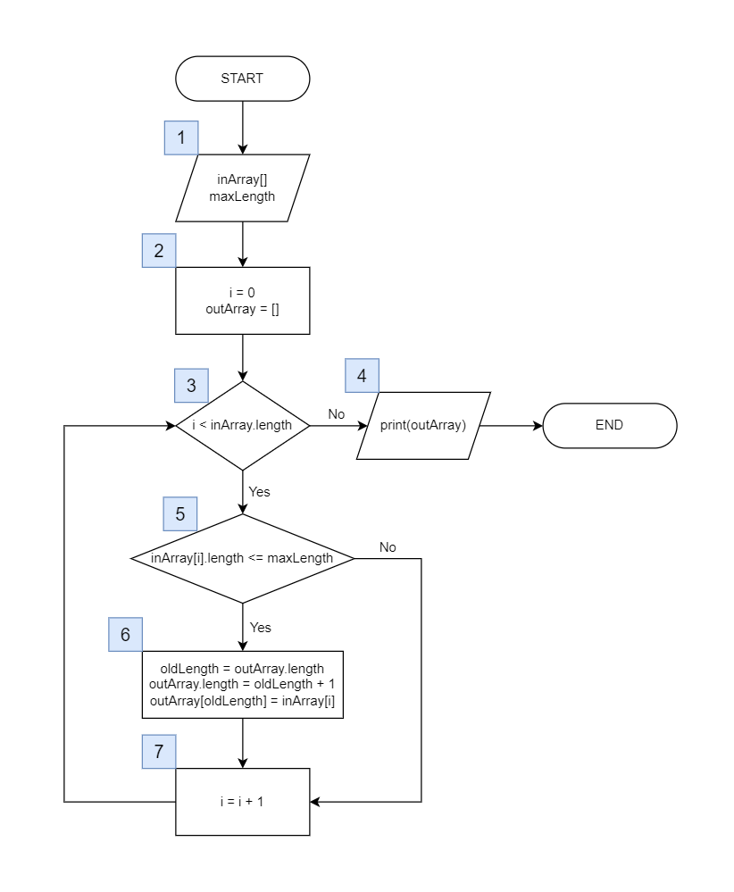

# Блок-схема алгоритма, формирующего из заданного массива строк массив строк, длина которых меньше либо равна указанному кол-ву символов.
## Программной реализацией данного алгоритма является метод filterStringsByLength в Programm.java

> ## 1
Передадим параметры:  
* inArray[] - представляет исходный массив строк
* maxLength - максимально допустимое кол-во символов в строке
> ## 2
Инициализируем переменные:  
* i - индекс для перебора элементов массива inArray
* outArray - результирующий массив, в который будут добавляться отфильтрованные строки
> ## 3
Если значение переменной i меньше размера массива inArray.length, то продолжаем обход элементов, иначе переходим к шагу 4.
> ## 4
Выводим результирующий массив строк и заканчиваем алгоритм.
> ## 5
Если длина строки i-го элемента массива inArray меньше либо равна maxLength, то переходим к шагу 6, иначе к шагу 7.
> ## 6
Увеличиваем размер массива outArray на 1 и добавляем в конец строку, проверенную на длину на шаге 4.
> ## 7
Увеличиваем значение переменной i на 1 и возвращаемся к шагу 3.